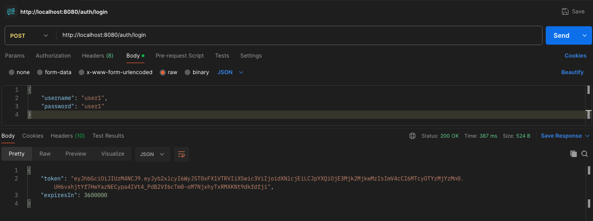
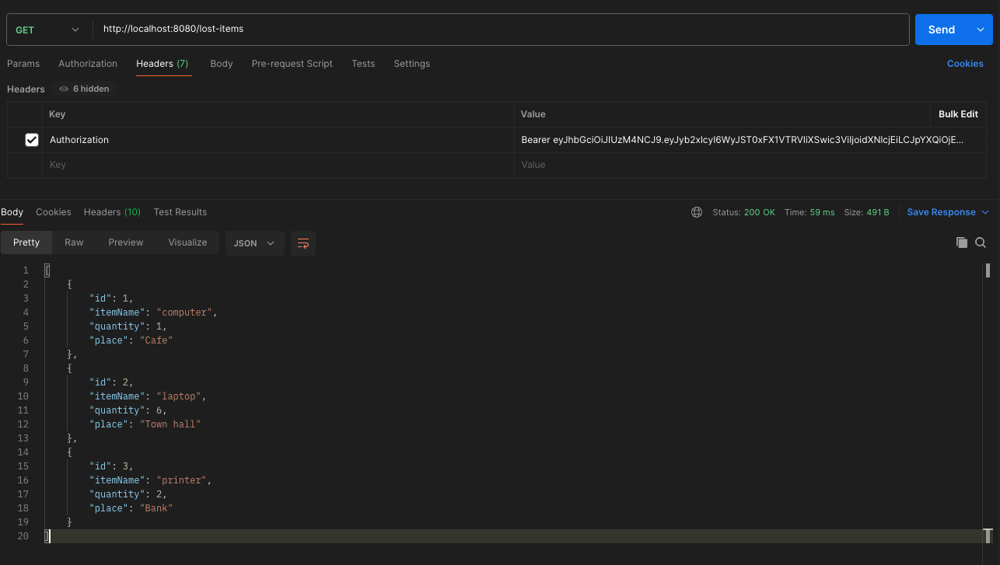
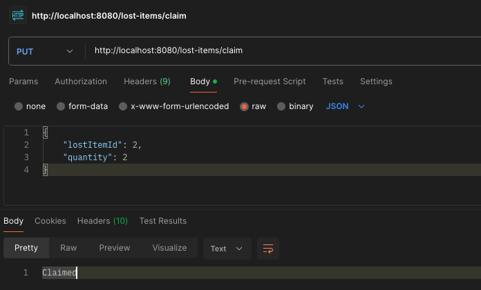
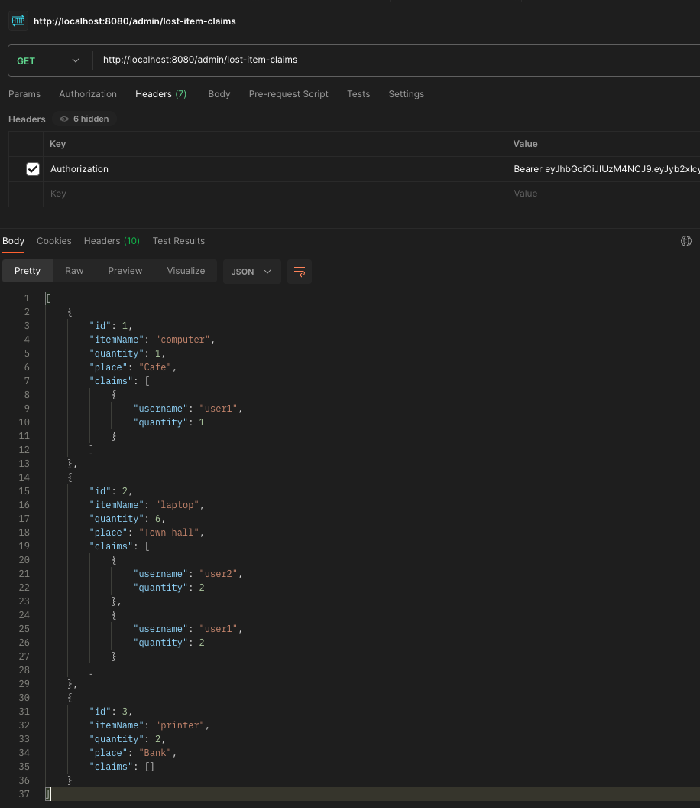
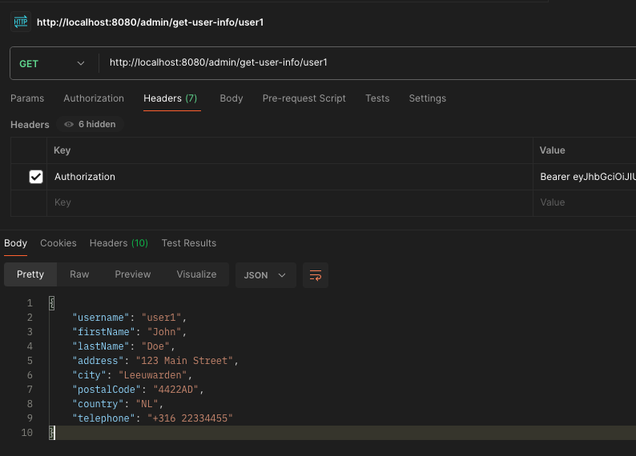
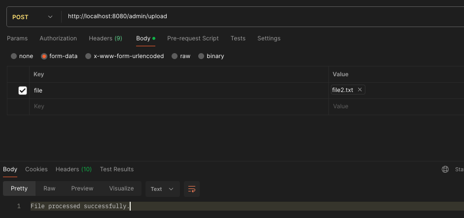
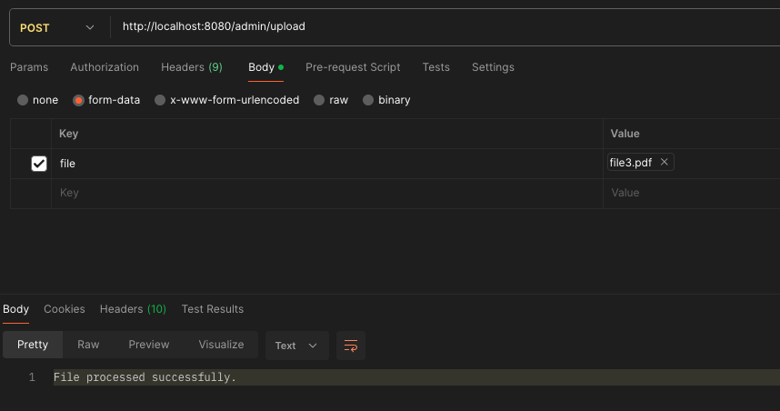
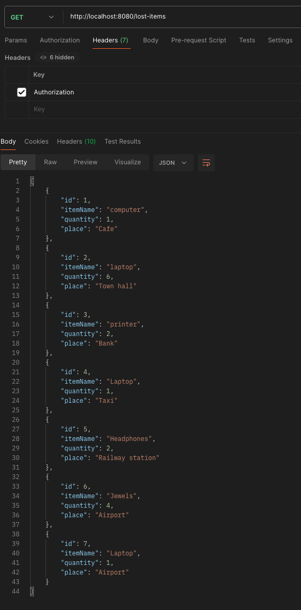

# Technical Challenge: Lost and Found Java API

This repository is created for a Technical Assignment for applying at a redacted\* company.
The service is an API which tracks a "Lost and Found" list:
- The admin can bulk-import LostItems
- users can see all current LostItems and create a claim on a LostItem
- the Admin can see all Claims on all LostItems
- the Admin can request additional information about a user via a mocked API

The original assignment is added in this repository at `documentation/TechnicalAssignment.pdf`

\*Redacted to avoid the indexing this repo, and giving the solution to others.

## Introduction

This service is a Java 21 + maven application using the following frameworks/libraries:
* **Spring Boot**: For setting up a JSON REST API quickly
* **Spring Boot Data/JPA**: For easier Database Entity & Repository writing
* **Spring Security**: For Identity management, Request filtering and access control
* **Spring Actuator**: Useful for production, gives health statuses to be used in external management controls/panels
* **Tomcat embedded server**: Connects our app to the local network with http for local development
* **Lombok**: For code generating boilerplate code (getters and setters mainly)
* **jjwt api+jackson**: for granting and checking JWT tokens
* **H2**: An in-memory database, useful for development
* **PDFBox**: For reading uploaded PDFs
* **Spring Test**: For easy test writing

Dev tools
* **Checkstyle**: Development tool, for code linting
* **Jacoco**: For gathering and generating code-coverage reports
* **Github Actions**: for basic CI, linting and running our tests

## Directory structure

The directory structure is as follows:

`src/main/dev/riemer/lostandfound`

> The project's root folder.

`lostandfound/controller`

> Controller directory, all API endpoints are defined here

`lostandfound/dto`

> Data Transfer Object (DTO) folder, contains all input JSON/Serializable Requests and Responses

`lostandfound/exceptions`

> Custom Exceptions handling are registered here

`lostandfound/fileprocessor`

> Contains FileProcessors for uploading bulk LostItem imports. Both TXT and PDF are supported.
> We use a Factory and Strategy pattern here to pick the right FileProcessor for the right job

`lostandfound/model`

> Our Database Entities are defined here

`lostandfound/reposistory`

> JPA Repositories to access said Entities are defined here

`lostandfound/security`

> JWT Handling and integration with Spring Boot Security are defined here

`lostandfound/service`

> Services for our application are saved here

## Building, Running and Testing the service

To run and test the application you can use the standardized mvnw and mvnw.cmd wrapper scripts.

Using the unix script, to build and run the application:

`./mvnw spring-boot:run`

To clean and run all tests:

`./mvnw clean test`

For verifying (also used in Github Actions/CI)

` ./mvnw verify`

## API Endpoints

### POST `/auth/login`

This service uses JWT for authentication so we need to obtain a token first.

The test dataset comes with an `admin` and 2 users (called `user1` and `user2`). 
The password is the same as the username. See below for an example

This token should then be used in the `Authorization` header, prefixed with `Bearer ${token}`.
See next endpoint for an example

### GET `/lost-items`

Returns all current LostItems in the database, which can be claimed by all users

### PUT `/lost-items/claim`

Allows the user to create a claim of a LostItem. The `lostItemId` and `quantity` should be entered in the body of the request

### GET `/admin/lost-item-claims`

Note that this is an Admin only endpoint, make sure to use the right user/token.
This endpoint allows the Admin to see all LostItems and their Claims

### GET `/admin/get-user-info/{username}`

Returns mock data for the username, so the Admin can contact the user

### POST `/admin/upload`

Allows the admin to bulk import LostItems. Current supported formats are PDF and plain TXT files. 
The PDF FileProcessor uses a simple text stripper, so no images can be processed as OCR is not applied.

See the folder `upload_examples` for files you can upload. Make sure to use `form-data` in postman for example, 
the key should be plain `file` and you need to change the type to `files` as well to get a file-picker in postman.

The FileProcessing can take some abuse:
- All lines are stripped from whitespaces
- Keys are processed case-insensitive
- Unknown keys are ignored
- The keys who are processed are `ItemName`, `Quantity` and `Place` and should use the data-types String, Int, String respectively.
- New items should always start with `ItemName`

#### Text Upload test

#### PDF Upload test

#### After uploading 1 of the files, result of GET `/lost-items`

